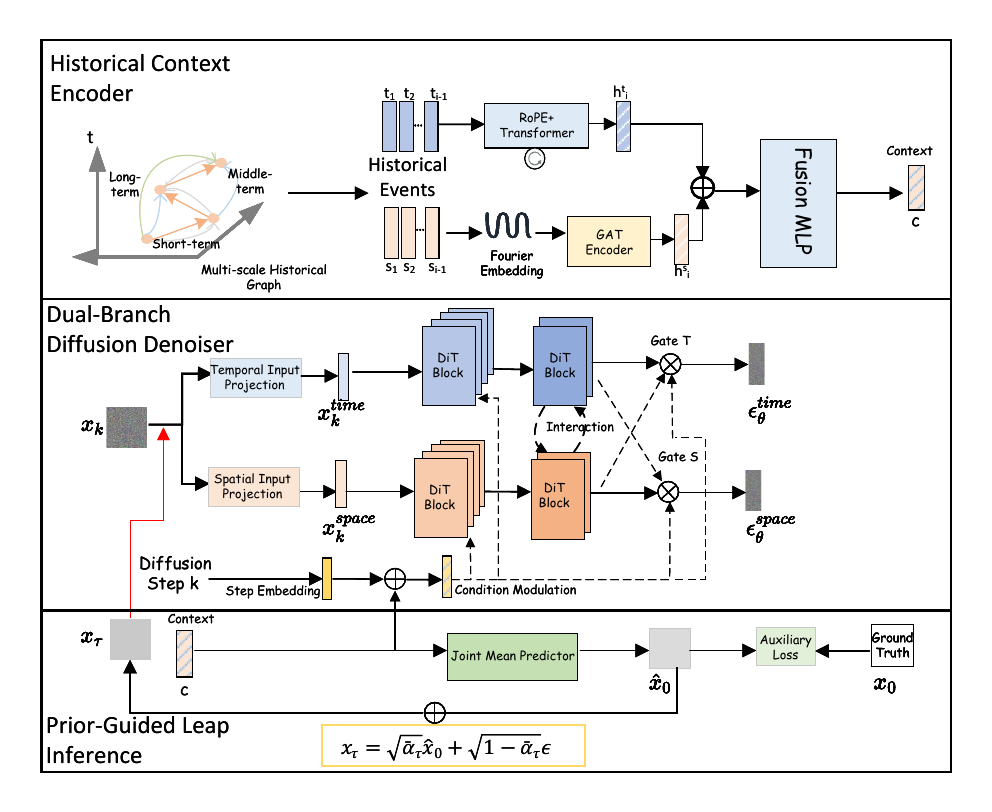

# GLIDE: Graph-guided Leap Inference for Diffusion Estimation of Spatio-Temporal Point Processes



This repository contains the official experimental code for our paper
**GLIDE: Graph-guided Leap Inference for Diffusion Estimation of
Spatio-Temporal Point Processes**, published at **PKDD 2026**.

Paper: [arXiv:2606.01273](https://arxiv.org/abs/2606.01273)

GLIDE is a conditional diffusion framework for next-event modeling in
spatio-temporal point processes. It combines multi-scale historical graph
conditioning, a dual-stream temporal/spatial encoder, a dual-branch diffusion
denoiser, and prior-guided leap inference for faster and more localized
generation.

The code includes the preprocessing, graph feature construction, model
configuration, training, evaluation, and visualization pipeline used in the
experiments. It builds on the original DSTPP implementation and DDPM-style
diffusion modeling.

The main entry points are:

- `preprocess.py`: build normalized, graph-enhanced sequence features.
- `app.py`: train, resume, evaluate, and optionally generate heatmap figures.
- `DSTPP/`: GLIDE model, diffusion, layer, and dataloader implementations.
- `dataset/`: raw dataset files. Processed files are generated locally.
- `logs/`: TensorBoard event files.
- `ModelSave/`: checkpoints and generated figures.

## Environment

The original DSTPP codebase was tested with Python 3.7 and PyTorch 1.7. This
GLIDE implementation also uses PyTorch Geometric, TensorBoard, EMA, Matplotlib,
and Seaborn as listed in `requirements.txt`.

Install dependencies after installing a CUDA-compatible PyTorch build:

```bash
pip install -r requirements.txt
```

If PyTorch Geometric cannot be installed from `requirements.txt`, install the
wheel that matches your local PyTorch and CUDA versions from the official PyG
instructions.

## Dataset Layout

This release includes only the raw train/validation/test splits. Each supported
dataset is organized as:

```text
dataset/
  Earthquake/
    data_train.pkl
    data_val.pkl
    data_test.pkl
  COVID19/
  Citibike/
  Crime/
```

The raw pickle files contain a list of event sequences. For the 2D datasets used
here, each raw event is expected to contain:

```text
[absolute_time, longitude_or_x, latitude_or_y]
```

During preprocessing, `preprocess.py` inserts the inter-event time interval and
internally uses:

```text
[absolute_time, time_interval, longitude_or_x, latitude_or_y]
```

Before training, run `preprocess.py` to generate graph-enhanced processed files.
The current `app.py` training path expects the canonical processed names:

```text
data_train_processed.pkl
data_val_processed.pkl
data_test_processed.pkl
stats.pkl
```

Important: the current `preprocess.py` writes `data_*_processed1.pkl` and
`stats1.pkl` to avoid overwriting existing files. To train after preprocessing,
either copy/rename these files to the canonical names or change `data_loader()`
in `app.py` to read the `*1.pkl` files.

Example canonicalization after preprocessing one dataset:

```bash
cp dataset/Earthquake/data_train_processed1.pkl dataset/Earthquake/data_train_processed.pkl
cp dataset/Earthquake/data_val_processed1.pkl dataset/Earthquake/data_val_processed.pkl
cp dataset/Earthquake/data_test_processed1.pkl dataset/Earthquake/data_test_processed.pkl
cp dataset/Earthquake/stats1.pkl dataset/Earthquake/stats.pkl
```

## Preprocessing

Preprocess a single dataset:

```bash
python preprocess.py --dataset Earthquake --dim 2
python preprocess.py --dataset COVID19 --dim 2
python preprocess.py --dataset Citibike --dim 2
python preprocess.py --dataset Crime --dim 2
```

Preprocess all datasets supported by `preprocess.py`:

```bash
python preprocess.py --all --dim 2
```

The preprocessing pipeline does the following:

1. Loads `data_train.pkl`, `data_val.pkl`, and `data_test.pkl`.
2. Adds inter-event time intervals.
3. Computes normalization statistics from the training split only.
4. Normalizes absolute time, inter-event time, location, and location
   differences.
5. Builds temporal multi-scale statistics: mean, standard deviation, and trend.
6. Builds spatial multi-scale statistics: mean, standard deviation, and
   displacement.
7. Builds graph edges over historical events. With the current dataset settings,
   multi-neighbor graph edges are disabled by `K_NEIGHBORS_GAT=(0,0,0)`, while
   consecutive temporal edges are still retained.
8. Saves processed train/validation/test files and normalization statistics.

### Preprocessing Parameters by Dataset

These values are defined in `preprocess.py`.

| Dataset | Temporal Windows | Spatial Windows | Grid Sizes | GAT Time Scales | GAT Neighbors |
| --- | --- | --- | --- | --- | --- |
| Earthquake | `[64, 32, 16, 8]` | `[64, 32, 16, 8]` | `[0.5, 0.2, 0.1, 0.05]` | `(0, 0, 0)` | `(0, 0, 0)` |
| COVID19 | `[14, 7]` | `[14, 7]` | `[0.1, 0.05]` | `(0, 0, 0)` | `(0, 0, 0)` |
| Citibike | `[32, 16, 8, 4]` | `[8, 6, 4, 2]` | `[0.02, 0.01, 0.005, 0.002]` | `(0, 0, 0)` | `(0, 0, 0)` |
| Crime | `[32, 16, 8, 4]` | `[32, 16, 8, 4]` | `[0.1, 0.05, 0.01, 0.005]` | `(15, 7, 3)` | `(0, 0, 0)` |

The model input dimension is computed dynamically in `app.py`:

```text
input_dim = 1 absolute time
          + 1 time interval
          + 2 * spatial_dim
          + 3 * number_of_temporal_windows
          + 3 * spatial_dim * number_of_spatial_windows
```

For the current 2D settings, this gives:

| Dataset | Input Dimension |
| --- | ---: |
| Earthquake | 42 |
| COVID19 | 24 |
| Citibike | 42 |
| Crime | 42 |

## Training

The common training command is:

```bash
python app.py \
  --dataset DATASET \
  --mode train \
  --timesteps 500 \
  --samplingsteps 500 \
  --batch_size BATCH_SIZE \
  --cuda_id 0 \
  --total_epochs 2000
```

Recommended commands used by this project:

```bash
python app.py --dataset Earthquake --mode train --timesteps 500 --samplingsteps 500 --batch_size 64 --cuda_id 0 --total_epochs 2000
python app.py --dataset COVID19 --mode train --timesteps 500 --samplingsteps 500 --batch_size 64 --cuda_id 0 --total_epochs 2000
python app.py --dataset Citibike --mode train --timesteps 500 --samplingsteps 500 --batch_size 128 --cuda_id 0 --total_epochs 2000
python app.py --dataset Crime --mode train --timesteps 500 --samplingsteps 500 --batch_size 64 --cuda_id 0 --total_epochs 2000
```

Note: `run.sh` may contain the typo `Citybikes`; the valid `app.py` dataset name
is `Citibike`.

### Model Parameters by Dataset

These values are defined in `app.py`.

| Dataset | `d_model` | `num_units` | Layers | Heads | Dropout | Spatial Dropout | Base LR | Interaction Start | Leapfrog Start Ratio | Guidance Scale |
| --- | ---: | ---: | ---: | ---: | ---: | ---: | ---: | ---: | ---: | ---: |
| Earthquake | 64 | 96 | 4 | 4 | 0.4 | 0.4 | `3e-4` | 4 | 0.4 | 0.1 |
| COVID19 | 32 | 32 | 4 | 4 | 0.5 | 0.5 | `5e-4` | 2 | 0.4 | 0.1 |
| Citibike | 64 | 64 | 5 | 4 | 0.5 | 0.5 | `3e-4` | 3 | 0.4 | 0.1 |
| Crime | 32 | 32 | 2 | 4 | 0.5 | 0.5 | `3e-4` | 0 | 0.4 | 0.5 |

Training uses:

- `AdamW` optimizer.
- Weight decay: `1e-4`.
- Automatic weighted loss parameter learning with LR `1e-3`.
- Cosine annealing scheduler with `eta_min=1e-6`.
- EMA with decay `0.999`.
- Mixed precision when CUDA is available.
- Evaluation every 10 epochs.
- 20 diffusion samples during validation/test metric computation.

## Evaluation and Resuming

Checkpoints are saved under:

```text
ModelSave/dataset_<DATASET>_timesteps_<TIMESTEPS>_gai/
```

Typical files:

```text
best_loss.ckpt
best_nll.ckpt
best_test_nll.ckpt
last.ckpt
```

Resume training:

```bash
python app.py \
  --dataset Earthquake \
  --mode train \
  --timesteps 500 \
  --samplingsteps 500 \
  --batch_size 64 \
  --cuda_id 0 \
  --total_epochs 2000 \
  --resume \
  --ckpt ./ModelSave/dataset_Earthquake_timesteps_500_gai/last.ckpt
```

Run test-only evaluation from a checkpoint:

```bash
python app.py \
  --dataset Earthquake \
  --mode test \
  --timesteps 500 \
  --samplingsteps 500 \
  --batch_size 64 \
  --cuda_id 0 \
  --resume \
  --ckpt ./ModelSave/dataset_Earthquake_timesteps_500_gai/best_test_nll.ckpt
```

Generate heatmaps and trajectory plots during evaluation:

```bash
python app.py \
  --dataset Earthquake \
  --mode test \
  --timesteps 500 \
  --samplingsteps 500 \
  --batch_size 64 \
  --cuda_id 0 \
  --resume \
  --ckpt ./ModelSave/dataset_Earthquake_timesteps_500_gai/best_test_nll.ckpt \
  --plot_heatmap
```

Figures are saved under the corresponding checkpoint directory, for example:

```text
ModelSave/dataset_Earthquake_timesteps_500_gai/heatmaps/
```

## TensorBoard

Training logs are written to:

```text
logs/<DATASET>_timesteps_<TIMESTEPS>_gai/
```

Start TensorBoard:

```bash
tensorboard --logdir ./logs --port 6006
```

Then open:

```text
http://localhost:6006
```

Useful scalar names include:

```text
Training/loss_epoch
Training/NLL_epoch
Evaluation/loss_val
Evaluation/NLL_val_PerEvent
Evaluation/NLL_test_PerEvent
Evaluation/NLL_temporal_test_PerEvent
Evaluation/NLL_spatial_test_PerEvent
Evaluation/mae_temporal_test
Evaluation/rmse_temporal_test
Evaluation/distance_spatial_test
Evaluation/Time_per_sample
```

## Command-line Arguments

Main `app.py` arguments:

| Argument | Default | Description |
| --- | --- | --- |
| `--dataset` | `Earthquake` | Dataset name. Run preprocessing first so processed files exist for the selected dataset. |
| `--mode` | `train` | `train` or `test`. Test mode evaluates once and exits. |
| `--seed` | `1234` | Random seed. |
| `--dim` | `2` | Spatial dimension. |
| `--batch_size` | `64` | Batch size. |
| `--total_epochs` | `1000` | Maximum number of epochs. |
| `--timesteps` | `100` | Diffusion training timesteps. Use `500` for the reported runs. |
| `--samplingsteps` | `100` | Diffusion sampling steps. Use `500` for the reported runs. |
| `--loss_type` | `l2` | Diffusion loss: `l1`, `l2`, or `Euclid`. |
| `--beta_schedule` | `cosine` | Diffusion beta schedule: `linear` or `cosine`. |
| `--objective` | `pred_noise` | Diffusion objective. |
| `--cuda_id` | `0` | CUDA device id. |
| `--resume` | off | Resume from checkpoint. |
| `--ckpt` | empty | Checkpoint path. |
| `--plot_heatmap` | off | Save heatmap and trajectory visualizations during evaluation. |

Main `preprocess.py` arguments:

| Argument | Default | Description |
| --- | --- | --- |
| `--dataset` | `Earthquake` | One of `Earthquake`, `COVID19`, `Citibike`, `Crime`. |
| `--dim` | `2` | Spatial dimension. |
| `--all` | off | Process all datasets supported by `preprocess.py`. |

## Troubleshooting Notes

- This release includes raw data only. Run `preprocess.py` before training.
- If training says a processed file is missing, make sure
  `data_train_processed.pkl`, `data_val_processed.pkl`,
  `data_test_processed.pkl`, and `stats.pkl` exist under the selected dataset.
- If you just ran `preprocess.py`, remember that it writes `*processed1.pkl` and
  `stats1.pkl`; copy or rename them before running `app.py`.
- If the machine has few CPU cores, reduce `num_workers=16` in
  `DSTPP/Dataset.py`.
- If TensorBoard is missing, install it with `pip install tensorboard` or from
  `requirements.txt`.
- If CUDA memory is tight, lower `batch_size`. Evaluation also uses 20 samples
  per batch in `app.py`.

## Citation

If this repository is useful for your research, please cite our GLIDE paper:

```bibtex
@inproceedings{zhou2026glide,
  title = {GLIDE: Graph-guided Leap Inference for Diffusion Estimation of Spatio-Temporal Point Processes},
  author = {Zhou, Guanyu and Liu, Yao and Gan, Yanglei and Cai, Yuxiang and He, Peng and Lin, Run and Liu, Yuxiang and Liu, Qiao},
  booktitle = {Proceedings of PKDD 2026},
  year = {2026}
}
```

You may also cite the arXiv version:

```bibtex
@article{zhou2026glide_arxiv,
  title = {GLIDE: Graph-guided Leap Inference for Diffusion Estimation of Spatio-Temporal Point Processes},
  author = {Zhou, Guanyu and Liu, Yao and Gan, Yanglei and Cai, Yuxiang and He, Peng and Lin, Run and Liu, Yuxiang and Liu, Qiao},
  journal = {arXiv preprint arXiv:2606.01273},
  year = {2026}
}
```

This implementation builds on the original DSTPP repository. Please also cite
DSTPP when appropriate:

```bibtex
@inproceedings{yuan2023DSTPP,
  author = {Yuan, Yuan and Ding, Jingtao and Shao, Chenyang and Jin, Depeng and Li, Yong},
  title = {Spatio-Temporal Diffusion Point Processes},
  year = {2023},
  booktitle = {Proceedings of the 29th ACM SIGKDD Conference on Knowledge Discovery and Data Mining},
  pages = {3173--3184},
}
```
